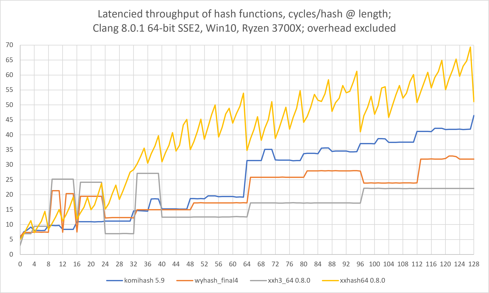

# KOMIHASH - Very Fast Hash Function (in C/C++) #

## Introduction ##

The `komihash()` function available in the `komihash.h` file implements a very
fast 64-bit hash function, mainly designed for hash-table, hash-map, and
bloom-filter uses; produces identical hashes on both big- and little-endian
systems. Function's code is portable, cross-platform, scalar, zero-allocation,
header-only, inlineable C (C++ compatible).

This function features both a high large-block hashing performance (26 GB/s
on Ryzen 3700X) and a high hashing throughput for small strings/messages
(about 9 cycles/hash for 0-15-byte strings). Performance on 32-bit systems
is, however, quite low. Also, large-block hashing performance on big-endian
systems may be 20% lower due to the need of byte-swapping (can be switched off
with a define).

Technically, `komihash` is close to the class of hash functions like `wyhash`
and `CircleHash`, which are, in turn, close to the `lehmer64` PRNG. However,
`komihash` is structurally different to them in that it accumulates the full
128-bit multiplication result, without "compression" into a single 64-bit
state variable. Thus `komihash` does not lose differentiation between
consecutive states while others may. Another important difference in
`komihash` is that it parses the input message without overlaps. While
overlaps allow a function to have fewer code branches, they are considered
"non-ideal", potentially causing collisions and seed value flaws. Beside that,
`komihash` features superior seed value handling and Perlin Noise hashing.

An aspect worth noting, important to some users, is that `komihash` at its
base uses a simple mathematical construct, and uses no author-intended nor
author-fabricated information. The base state of the function is equal to the
first mantissa bits of PI, and can be changed to any uniformly-random values.
This means that statistical properties (collision resistance) of `komihash`
are not based on manual fine-tuning, but are a product of the mathematical
construct.

Note that this function is not cryptographically-secure: in open systems, and
within any server-side internal structures, it should only be used with a
secret seed, to minimize the chance of a collision attack (hash flooding).
However, when the default seed is used (0), this further reduces function's
overhead by 1-2 cycles/hash (compiler-dependent).

This function passes all [SMHasher](https://github.com/rurban/smhasher) tests.
The performance (expressed in cycles/byte) of this hash function on various
platforms is best evaluated at the
[ECRYPT/eBASH project](https://bench.cr.yp.to/results-hash.html).

This function and its source code (which is
[ISO C99](https://en.wikipedia.org/wiki/C99)) were quality-tested on:
Clang, GCC, MSVC, Intel C++ compilers; x86, x86-64 (Intel, AMD), AArch64
(Apple Silicon) architectures; Windows 10, CentOS 8 Linux, macOS 13.3.

## Discrete-Incremental Hashing ##

A correct way to hash an array of independent values, and which does not
require pre-buffering, is to pass previous hash value as a seed value. This
method may be as fast or faster than pre-buffering, especially if lengths of
values in the array are not small. An additional 1-2 cycles/hash advantage is
obtained if fixed-size values are being hashed incrementally (due to
compiler's branching optimization). In most cases, incremental hashing of even
a few 2-8-byte values may be faster than using pre-buffering if the overall
input length is not known in advance.

```c
uint64_t HashVal = komihash( &val1, sizeof( val1 ), Seed );
HashVal = komihash( &val2, sizeof( val2 ), HashVal );
...
HashVal = komihash( &valN, sizeof( valN ), HashVal );
```

Note that this approach is not the same as "streamed" hashing since this
approach implicitly encodes the length of each independent value. Such kind of
hashing can be beneficial when a database record is being hashed, when it is
necessary to separate fields by means of encoding their lengths.

Discrete-incremental hashing of nested structures requires a "hash value
stack" where the current hash value is pushed into it upon each nesting, the
nested level starts at hash value 0, and the resulting value is hashed with a
popped previous hash value upon exiting the nesting level.

## Streamed Hashing ##

The `komihash.h` file also features a fast continuously-streamed
implementation of the `komihash` hash function. Streamed hashing expects any
number of `update` calls inbetween the `init` and `final` calls:

```c
komihash_stream_t ctx;
komihash_stream_init( &ctx, UseSeed );

komihash_stream_update( &ctx, &val1, sizeof( val1 ));
komihash_stream_update( &ctx, &val2, sizeof( val2 ));
...
komihash_stream_update( &ctx, &valN, sizeof( valN ));

uint64_t Hash = komihash_stream_final( &ctx );
```

Since the `final` function is non-destructive to the context structure, the
function can be used to obtain intermediate "incremental" hashes of the data
stream being hashed, and the hashing can then be resumed.

The hash value produced via streamed hashing can be used in the
discrete-incremental hashing outlined above (e.g., for files and blobs).

You may also consider using [PRVHASH64S](https://github.com/avaneev/prvhash)
which provides 8.5 GB/s hashing throughput on Ryzen 3700X, and is able to
produce a hash value of any required bit-size.

## Ports ##

* [Java, by Dynatrace](https://github.com/dynatrace-oss/hash4j)
* [LUA, by rangercyh](https://github.com/rangercyh/lua-komihash)
* [.NET, by TommasoBelluzzo](https://www.nuget.org/packages/FastHashes/)
* [Rust, by thynson](https://crates.io/crates/komihash)
* [Zig, by tensorush](https://github.com/tensorush/zig-komihash)

## Comparisons ##

These are the performance comparisons made and used by the author during the
development of `komihash`.

### LLVM clang-cl 8.0.1 64-bit, Windows 10, Ryzen 3700X (Zen2), 4.2 GHz ###

Compiler options: `/Ox /arch:sse2`; overhead: `1.8` cycles/h.

|Hash function    |0-15b, cycles/h|8-28b, cycles/h|bulk, GB/s     |
|----             |----           |----           |----           |
|**komihash 5.10**|10.2           |12.1           |26.2           |
|komihash 4.5     |11.0           |12.7           |26.2           |
|komihash 4.3     |11.2           |13.0           |26.0           |
|komihash 3.6     |11.1           |16.9           |27.5           |
|komihash 2.8     |11.3           |17.4           |27.7           |
|wyhash_final4    |14.2           |18.2           |29.7           |
|XXH3_64 0.8.0    |17.5           |21.1           |29.0           |
|XXH64 0.8.0      |12.7           |17.3           |17.3           |

Compiler options: `/Ox -mavx2`; overhead: `1.8` cycles/h.

|Hash function    |0-15b, cycles/h|8-28b, cycles/h|bulk, GB/s     |
|----             |----           |----           |----           |
|**komihash 5.10**|10.2           |12.0           |26.2           |
|komihash 4.5     |11.1           |12.7           |26.3           |
|komihash 4.3     |11.2           |13.0           |25.9           |
|komihash 3.6     |11.0           |16.3           |27.5           |
|komihash 2.8     |11.1           |17.7           |27.8           |
|wyhash_final4    |14.2           |18.2           |29.8           |
|XXH3_64 0.8.0    |17.7           |21.3           |61.0           |
|XXH64 0.8.0      |12.8           |17.4           |17.1           |

### ICC 19.0 64-bit, Windows 10, Ryzen 3700X (Zen2), 4.2 GHz ###

Compiler options: `/O3 /QxSSE2`; overhead: `2.0` cycles/h.

|Hash function    |0-15b, cycles/h|8-28b, cycles/h|bulk, GB/s     |
|----             |----           |----           |----           |
|**komihash 5.10**|12.3           |14.6           |23.1           |
|komihash 4.5     |18.1           |21.9           |16.4           |
|komihash 4.3     |17.9           |21.6           |16.3           |
|komihash 3.6     |20.1           |24.0           |16.3           |
|komihash 2.8     |21.3           |25.6           |16.2           |
|wyhash_final4    |25.9           |32.9           |12.5           |
|XXH3_64 0.8.0    |21.8           |27.2           |29.6           |
|XXH64 0.8.0      |24.3           |36.6           |8.9            |

(this is likely a worst-case scenario, when a compiler was not cross-tuned
to a competing processor architecture; also, ICC for Windows does not support
the `__builtin_expect` and `__builtin_prefetch` intrinsics)

### LLVM clang 12.0.1 64-bit, CentOS 8, Xeon E-2176G (CoffeeLake), 4.5 GHz ###

Compiler options: `-O3 -mavx2`; overhead: `5.3` cycles/h.

|Hash function    |0-15b, cycles/h|8-28b, cycles/h|bulk, GB/s     |
|----             |----           |----           |----           |
|**komihash 5.10**|12.7           |13.8           |23.3           |
|komihash 4.5     |12.8           |14.4           |22.4           |
|komihash 4.3     |15.3           |16.3           |22.8           |
|komihash 3.6     |16.0           |19.0           |22.3           |
|komihash 2.8     |18.1           |22.3           |23.5           |
|wyhash_final4    |16.2           |19.7           |29.2           |
|XXH3_64 0.8.0    |18.0           |29.3           |51.0           |
|XXH64 0.8.0      |12.5           |16.4           |18.2           |

### GCC 8.5.0 64-bit, CentOS 8, Xeon E-2176G (CoffeeLake), 4.5 GHz ###

Compiler options: `-O3 -msse2`; overhead: `5.8` cycles/h.

|Hash function    |0-15b, cycles/h|8-28b, cycles/h|bulk, GB/s     |
|----             |----           |----           |----           |
|**komihash 5.10**|13.2           |14.6           |25.3           |
|komihash 4.5     |13.2           |15.1           |24.7           |
|komihash 4.3     |15.4           |16.2           |24.4           |
|komihash 3.6     |16.4           |20.3           |24.7           |
|komihash 2.8     |18.5           |22.4           |24.7           |
|wyhash_final4    |17.6           |20.1           |30.6           |
|XXH3_64 0.8.0    |16.9           |22.3           |26.6           |
|XXH64 0.8.0      |13.7           |17.7           |18.0           |

Compiler options: `-O3 -mavx2`; overhead: `5.8` cycles/h.

|Hash function    |0-15b, cycles/h|8-28b, cycles/h|bulk, GB/s     |
|----             |----           |----           |----           |
|**komihash 5.10**|13.2           |14.6           |25.4           |
|komihash 4.5     |13.8           |15.2           |24.7           |
|komihash 4.3     |15.3           |16.4           |24.4           |
|komihash 3.6     |15.8           |20.1           |24.7           |
|komihash 2.8     |16.6           |21.2           |24.7           |
|wyhash_final4    |16.8           |19.7           |29.9           |
|XXH3_64 0.8.0    |18.8           |23.4           |38.0           |
|XXH64 0.8.0      |15.3           |17.9           |18.1           |

### LLVM clang-cl 8.0.1 64-bit, Windows 10, Core i7-7700K (KabyLake), 4.5 GHz ###

Compiler options: `/Ox -mavx2`; overhead: `5.5` cycles/h.

|Hash function    |0-15b, cycles/h|8-28b, cycles/h|bulk, GB/s     |
|----             |----           |----           |----           |
|**komihash 5.10**|11.9           |13.6           |21.3           |
|komihash 4.5     |12.6           |14.5           |22.2           |
|komihash 4.3     |14.1           |16.0           |22.0           |
|komihash 3.6     |14.0           |22.0           |22.9           |
|komihash 2.8     |13.4           |22.7           |23.7           |
|wyhash_final4    |15.5           |20.4           |29.8           |
|XXH3_64 0.8.0    |18.4           |23.0           |48.3           |
|XXH64 0.8.0      |13.2           |17.3           |17.7           |

### ICC 19.0 64-bit, Windows 10, Core i7-7700K (KabyLake), 4.5 GHz ###

Compiler options: `/O3 /QxSSE2`; overhead: `5.9` cycles/h.

|Hash function    |0-15b, cycles/h|8-28b, cycles/h|bulk, GB/s     |
|----             |----           |----           |----           |
|**komihash 5.10**|15.5           |18.6           |19.3           |
|komihash 4.5     |18.1           |21.1           |17.2           |
|komihash 4.3     |18.7           |21.5           |18.5           |
|komihash 3.6     |19.5           |23.1           |18.1           |
|komihash 2.8     |20.1           |23.6           |18.4           |
|wyhash_final4    |21.1           |26.1           |19.4           |
|XXH3_64 0.8.0    |19.9           |25.8           |28.0           |
|XXH64 0.8.0      |18.8           |24.7           |16.0           |

### Apple clang 12.0.0 64-bit, macOS 12.0.1, Apple M1, 3.5 GHz ###

Compiler options: `-O3`; overhead: `0` (unestimatable).

|Hash function    |0-15b, cycles/h|8-28b, cycles/h|bulk, GB/s     |
|----             |----           |----           |----           |
|**komihash 5.10**|8.2            |8.4            |23.6           |
|komihash 4.5     |8.3            |8.7            |23.6           |
|komihash 4.3     |8.6            |9.0            |23.6           |
|komihash 3.6     |8.5            |10.7           |23.6           |
|komihash 2.8     |10.1           |11.4           |23.5           |
|wyhash_final4    |7.9            |8.1            |26.1           |
|XXH3_64 0.8.0    |8.2            |8.2            |30.5           |
|XXH64 0.8.0      |8.8            |10.4           |14.5           |

Notes: `XXH3_64` is unseeded (seeded variant is 1 cycle/h higher). `bulk` is
256000 bytes: this means it is mainly a cache-bound performance, not
reflective of high-load situations. `GB/s` should not be misinterpreted as
`GiB/s`. `cycles/h` means `processor clock ticks per hash value`, including
overhead. Measurement error is approximately 3%.

### Averages over all measurements (overhead excluded) ###

|Hash function    |0-15b, cycles/h|8-28b, cycles/h|
|----             |----           |----           |
|**komihash 5.10**|**8.2**        |**9.8**        |
|komihash 4.5     |9.5            |11.4           |
|komihash 4.3     |10.4           |12.1           |
|komihash 3.6     |10.9           |15.4           |
|komihash 2.8     |11.8           |16.7           |
|wyhash_final4    |12.8           |16.6           |
|XXH3_64 0.8.0    |13.7           |18.6           |
|XXH64 0.8.0      |10.9           |15.8           |

This is the throughput comparison of hash functions on Ryzen 3700X. The used
measurement method actually measures hash function's "latencied throughput",
or sequential hashing, due to the use of the "volatile" variable specifiers
and result accumulation.



The following method was used to obtain the `cycles/h` values. Note that this
method measures a "raw" throughput, when processor's branch predictor tunes to
a specific message length and a specific memory address. Practical performance
depends on actual statistics of strings (messages) being hashed, including
memory access patterns. Note that particular hash functions may "over-favor"
specific message lengths. In this respect, `komihash` does not "favor" any
specific length, thus it may be more universal. Throughput aside, hashing
quality is also an important factor since it drives a hash-map's creation and
subsequent accesses. This, and many other synthetic hash function tests should
be taken with a grain of salt. Only an actual use-case can reveal which hash
function is preferrable.

```c++
const uint64_t rc = 1ULL << 26;
const int minl = 8; const int maxl = 28;
volatile uint64_t msg[ 8 ] = { 0 };
uint64_t v = 0;

const TClock t1( CSystem :: getClock() );

for( int k = minl; k <= maxl; k++ )
{
    volatile size_t msgl = k;
    volatile uint64_t sd = k + 1;

    for( uint64_t i = 0; i < rc; i++ )
    {
        v ^= komihash( (uint8_t*) &msg, msgl, sd );
//        v ^= wyhash( (uint8_t*) &msg, msgl, sd, _wyp );
//        v ^= XXH3_64bits( (uint8_t*) &msg, msgl );
//        v ^= msg[ 0 ]; // Used to estimate the overhead.
        msg[ 0 ]++;
    }
}

printf( "%016llx\n", v );
printf( "%.1f\n", CSystem :: getClockDiffSec( t1 ) * 4.2e9 /
    ( rc * ( maxl - minl + 1 ))); // 4.5 on Xeon, 4.5 on i7700K, 3.5 on M1
```

## Discussion ##

You may wonder, why `komihash` does not include a quite common `^MsgLen` XOR
instruction at some place in the code? The main reason is that due to the way
`komihash` parses the input message such instruction is not necessary. Another
reason is that for a non-cryptographic hash function such instruction provides
no additional security: while it may seem like such instruction protects from
simple "state XORing" collision attacks, in practice it offers no protection,
if one considers how powerful [SAT solvers](https://github.com/pysathq/pysat)
are: in less than a second they can "forge" a preimage which produces a
required hash value. It is also important to note that in such "fast" hash
functions like `komihash` the input message has complete control over the
state variables and the result.

Is 128-bit version of this hash function planned? Most probably, no, it is
not. While such version may be reasonable for data structure compatibility
reasons, there is no much practical sense to use 128-bit hashes at a local
level: a reliable 64-bit hash allows one to have 2.1 billion diverse binary
objects (e.g. files in a file system, or entries in a hash-map) without
collisions, on average. On the other hand, on a worldwide scale, having
128-bit hashes is clearly not enough considering the number of existing
digital devices and the number of diverse binary objects (e.g. files, records
in databases) on each of them.

An opinion on the "bulk" performance of "fast" hash functions: in most
practical situations, when processor's total memory bandwidth is limited to
e.g. 41 GB/s, a "bulk" single-threaded hashing performance on the order of
30 GB/s is excessive considering memory bandwidth has to be spread over
multiple cores. So, practically, such "fast" hash function, working on a
high-load 8-core server, rarely receives more than 8 GB/s of bandwidth.
Another factor worth a mention is that a server rarely has more than 10 Gb/s
network connectivity, thus further reducing practical hashing performance of
incoming data. The same applies to disk system's throughput, if on-disk data
is not yet in memory.

## KOMIRAND ##

The `komirand()` function available in the `komihash.h` file implements a
simple, but reliable, self-starting, and fast (`0.62` cycles/byte) 64-bit
pseudo-random number generator (PRNG) with `2^64` period. It is based on the
same mathematical construct as the `komihash` hash function. `komirand`
passes `PractRand` tests.

The PRNG has a 128-bit state which is divided into two 64-bit unsigned integer
variables ($s_{1}$ and $s_{2}$).

$$ m_{128}=s_{1} * s_{2} $$

$$ s_{2}'=(s_{2}+\lfloor m_{128} / 2^{64} \rfloor +C) \mod 2^{64} $$

$$ s_{1}'=(m_{128} \mod 2^{64}) \oplus s_{2}' $$

$C$ is any optional 64-bit constant (to facilitate PRNG auto-start from
$m_{128}=0$ state), but can be zero if such auto-start is not needed.
$s_{1}'$ is used as PRNG output.

This construct can be scaled to any even-sized registers beside 64-bit ones
(e.g., 32, 48) - it is invariant to the register size. The $C$ used in
`komirand` (`0xAAAA...`) is a good choice as such constant carries no spectral
information, and its influence on the statistics and modes is minimal.

For hashing, the following expression for $m_{128}$ is used:

$$ m_{128}=(s_{1} \oplus x_{1}) * (s_{2} \oplus x_{2}) $$

Where $x_{1}$ and $x_{2}$ are 64-bit parts of a message/string being hashed.
Since $s_{1}$ and $s_{2}$ are uniformly-distributed values, such mixing is
equivalent to mixing a message with a cryptographic one-time-pad (bitwise
modulo 2 addition). Message's statistics and distribution become unimportant,
and do not change the uniform distribution of $s_{1}$ and $s_{2}$.

## Other ##

This function is named the way it is named is to honor
the [Komi Republic](https://en.wikipedia.org/wiki/Komi_Republic) (located in
Russia), native to the author.

## Test Vectors ##

Test vectors for the current version of `komihash`, string-hash pairs (note
that the parentheses are not included in the calculation). The `bulk` is a
buffer with increasing 8-bit values; `bulk` hashes are calculated from this
buffer using various lengths. See the `testvec.c` file for details.

```
komihash UseSeed = 0x0000000000000000:
"This is a 32-byte testing string" = 0x05ad960802903a9d
"The cat is out of the bag" = 0xd15723521d3c37b1
"A 16-byte string" = 0x467caa28ea3da7a6
"The new string" = 0xf18e67bc90c43233
"7 chars" = 0x2c514f6e5dcb11cb
bulk(3) = 0x7a9717e9eea4be8b
bulk(6) = 0xa56469564c2ea0ff
bulk(8) = 0x00b4313a24431306
bulk(12) = 0x64c2ad96013f70fe
bulk(20) = 0x7a3888bc95545364
bulk(31) = 0xc77e02ed4b201b9a
bulk(32) = 0x256d74350303a1ba
bulk(40) = 0x59609c71697bb9df
bulk(47) = 0x36eb9e6a4c2c5e4b
bulk(48) = 0x8dd56c332850baa6
bulk(56) = 0xcbb722192b353999
bulk(64) = 0x90b07e2158f88cc0
bulk(72) = 0x24c9621701603741
bulk(80) = 0x1d4c1d97ca684334
bulk(112) = 0xd1a425d530652287
bulk(132) = 0x72623be342c20ab5
bulk(256) = 0x94c3dbdca59ddf57

komihash UseSeed = 0x0123456789abcdef:
"This is a 32-byte testing string" = 0x6ce66a2e8d4979a5
"The cat is out of the bag" = 0x5b1da0b43545d196
"A 16-byte string" = 0x26af914213d0c915
"The new string" = 0x62d9ca1b73250cb5
"7 chars" = 0x90ab7c9f831cd940
bulk(3) = 0x84ae4eb65b96617e
bulk(6) = 0xaceebc32a3c0d9e4
bulk(8) = 0xdaa1a90ecb95f6f8
bulk(12) = 0xec8eb3ef4af380b4
bulk(20) = 0x07045bd31abba34c
bulk(31) = 0xd5f619fb2e62c4ae
bulk(32) = 0x5a336fd2c4c39abe
bulk(40) = 0x0e870b4623eea8ec
bulk(47) = 0xe552edd6bf419d1d
bulk(48) = 0x37d170ddcb1223e6
bulk(56) = 0x1cd89e708e5098b6
bulk(64) = 0x765490569ccd77f2
bulk(72) = 0x19e9d77b86d01ee8
bulk(80) = 0x25f83ee520c1d241
bulk(112) = 0xd6007417091cd4c0
bulk(132) = 0x3e49c2d3727b9cc9
bulk(256) = 0xb2b3405ee5d65f4c

komihash UseSeed = 0x0000000000000100:
"This is a 32-byte testing string" = 0x5f197b30bcec1e45
"The cat is out of the bag" = 0xa761280322bb7698
"A 16-byte string" = 0x11c31ccabaa524f1
"The new string" = 0x3a43b7f58281c229
"7 chars" = 0xcff90b0466b7e3a2
bulk(3) = 0x8ab53f45cc9315e3
bulk(6) = 0xea606e43d1976ccf
bulk(8) = 0x889b2f2ceecbec73
bulk(12) = 0xacbec1886cd23275
bulk(20) = 0x57c3affd1b71fcdb
bulk(31) = 0x7ef6ba49a3b068c3
bulk(32) = 0x49dbca62ed5a1ddf
bulk(40) = 0x192848484481e8c0
bulk(47) = 0x420b43a5edba1bd7
bulk(48) = 0xd6e8400a9de24ce3
bulk(56) = 0xbea291b225ff384d
bulk(64) = 0x0ec94062b2f06960
bulk(72) = 0xfa613272ecd49985
bulk(80) = 0x76f0bb380bc207be
bulk(112) = 0x4afb4e08ca77c020
bulk(132) = 0x410f9c129ad88aea
bulk(256) = 0x066c7b25f4f569ae

komirand Seed1/Seed2 = 0x0000000000000000:
0xaaaaaaaaaaaaaaaa
0xfffffffffffffffe
0x4924924924924910
0xbaebaebaebaeba00
0x400c62cc4727496b
0x35a969173e8f925b
0xdb47f6bae9a247ad
0x98e0f6cece6711fe
0x97ffa2397fda534b
0x11834262360df918
0x34e53df5399f2252
0xecaeb74a81d648ed

komirand Seed1/Seed2 = 0x0123456789abcdef:
0x776ad9718078ca64
0x737aa5d5221633d0
0x685046cca30f6f44
0xfb725cb01b30c1ba
0xc501cc999ede619f
0x8427298e525db507
0xd9baf3c54781f75e
0x7f5a4e5b97b37c7b
0xde8a0afe8e03b8c1
0xb6ed3e72b69fc3d6
0xa68727902f7628d0
0x44162b63af484587

komirand Seed1/Seed2 = 0x0000000000000100:
0xaaaaaaaaaaababaa
0xfffffffff8fcf8fe
0xdb6dba1e4dbb1134
0xf5b7d3aec37f4cb1
0x66a571da7ded7051
0x2d59ec9245bf03d9
0x5c06a41bd510aed8
0xea5e7ea9d2bd07a2
0xe395015ddce7756f
0xc07981aaeaae3b38
0x2e120ebfee59a5a2
0x9001eee495244dba

```
